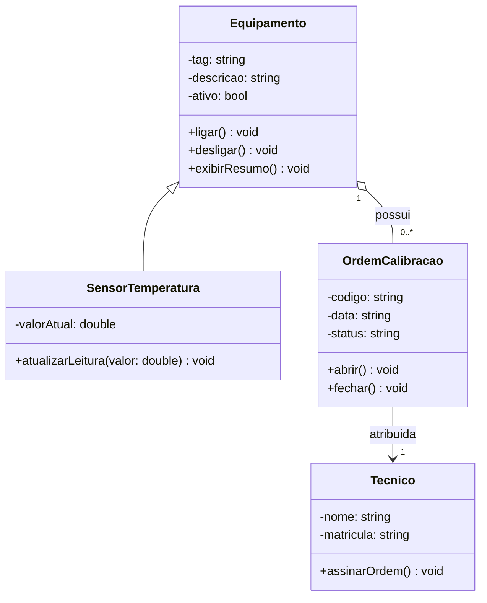

# Diagrama de Classe - Entrega do Aluno

## 1. Requisito resumido

O sistema do laboratório deve controlar equipamentos utilizados em ensaios e os sensores de temperatura associados a eles. Cada equipamento possui identificação, descrição e estado operacional. Os sensores registram leituras de temperatura em tempo real. Quando um equipamento necessita de verificação metrológica, uma ordem de calibração é criada para registrar o processo. Cada ordem possui data, status e um técnico responsável pela execução da calibração. O objetivo do sistema é organizar e rastrear essas informações de forma estruturada.

## 2. Link do Mermaid Live

Não utilizado.

## 3. Diagrama final em Mermaid

## 4. Justificativa das relacoes

- SensorTemperatura herda de Equipamento para reutilizar atributos e comportamentos básicos, adicionando o controle de temperatura.

- Equipamento possui OrdemCalibracao porque um equipamento pode passar por diversas calibrações ao longo de sua vida útil.

- OrdemCalibracao está associada a Tecnico porque cada ordem deve possuir um técnico responsável pela execução da calibração.

## 5. Linguagem escolhida

- [ ] C++
- [x] Python

## 6. Evidencias de execucao

Programa executado com sucesso utilizando Python.

Saída obtida:

[Equipamento] EQ-01 - Agitador principal - ativo=True
[SensorTemperatura] TT-01 - valorAtual=23.5
[SensorTemperatura] TT-01 - valorAtual=24.2

Foi verificada a criação dos objetos, exibição dos dados e atualização da leitura do sensor.
